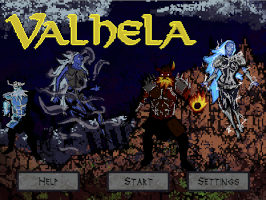

## Games

### <u>Salvager (2023)</u>
Salvager was my Capstone project at Full Sail Univerity where I developed Custom Engine Technology and Tooling to implement a simple ARPG game as a solo developer over the couse of 4 months. Most of the technology used was developed from scratch excluding the use of FBX SDK to import mesh assets and [Nuklear](https://github.com/Immediate-Mode-UI/Nuklear) to handle User Interfaces.

 

Features developed for this project include: 
 - Custom ECS framework using C++ Templates and Archetype grouping
 - Tiled, Deferred Renderer with support for Directional and Point Lights
 - Skeletal Animation System with Animation Notifys
 - Collision Detection and Resolution
 - AI Statemachine-based Behaviors
 - Scene Hierarchy with Object Parenting
 - Fully Physically Based Shaders and Materials
 - Custom TGA and DDS file importing for Textures
 - XAudio2 Implementation
 - Debug Visualizations

 

### <u>Space Dasher (2023)</u>



<video width="600" height="337.5" controls>
<source src="https://github.com/sreetunks/website/raw/refs/heads/main/content/projects/Space_Dasher_Preview.mp4" type="video/mp4">
</video>


Space Dasher was a Side-scrolling Shoot ‘em up written in C++ using Vulkan, [FLECS](https://github.com/SanderMertens/flecs) and [Gateware](https://gitlab.com/gateware-development/gateware), a middleware API provided as part of the class, at Full Sail for my Game Development Bachelor's Degree Program as part of a team of four over the course of a month. I was the Graphics Programmer for the team and was solely responsible for writing all of the Rendering Logic from scratch and integrating it with other systems that used the FLECS ECS API.
As part of this project, I implemented fully instanced 3D Textured Mesh Rendering, using a helper application provided as part of the class to load mesh data from OBJ files, SDF Rendering for our UI drawing, Directional Light Shadow mapping, DDS and TGA Texture Data loading, Skyboxes and a Bloom effect. I also helped with Gameplay systems like Collision Detection, Game State transitions and implemented Debug Visualizations for Collider shapes and an Orthographic View. The final submission was very well-received and was deemed *“the benchmark for projects in this class moving forward”*.

### <u>CodeBreakers (2022)</u>



<video width="600" height="337.5" controls>
<source src="https://github.com/sreetunks/website/raw/refs/heads/main/content/projects/Code_Breakers_Preview.mp4" type="video/mp4">
</video>


CodeBreakers was the mid-term project for my Game Development Bachelor's Degree Program. It is a Top-down Turn-based Tactics Game made in Unity3D with a team of 4 Programmers within a span of 3 weeks.
I worked on architecting the Grid System for the Game, the Turn Order system, and a Framework for implementing various Unit Abilities and AI Controllers. I also created a shader to render the Grid with a single Quad and augmented the URP Renderer with a custom Grid Rendering Feature and Stencil Testing Features.



<iframe height="181.5" frameborder="0" src="https://itch.io/embed/1697301" width="600"><a href="https://sreetunks.itch.io/code-breakers">Code Breakers by sreetunks, Tee97, RuKira</a></iframe>



### <u>Realms of Destiny (2017)</u>



<iframe width="600" height="337.5" src="https://www.youtube.com/embed/h38T1eN82D0?rel=0;autoplay=0;modestbranding=1;fs=0" title="Realms of Destiny by Half-Lens" frameborder="0" allow="accelerometer; encrypted-media; gyroscope"></iframe>



Realms of Destiny was the End of year project during my Second year at Rubika Supinfogame, Pune. It was a 2.5D Side-scroller Metroidvania game made using the Unity3D Engine by a team with 3 other Designers and 2 Artists in a duration of 6 months. I was the only Programmer and implemented Character Movement, Enemy AI and Animation State Machines. I also helped design a World zone and a few Boss Enemy Attack Phases.
The game was presented before an academic jury and was well received for its Gameplay as well as Production Quality for it being a student project.

### <u>Valhela (2016)</u>



Valhela was a tower defense game made as an End-of-Year project for my first year at Rubike Supinfogame, Pune.
The Game was developed with a team of 4 Designers and one Game artist using the Stencyl Game Engine where I took on dual responsibilities as Game Designer and only Gameplay scripter.
I implemented special gameplay abilities for all the towers in the game and pathfinding for the enemies that gave engaging results while remaining performant within the constraints of Stencyl. I also designed 3 levels in the game and also conceived and developed the gameplay abilities for all the Towers in the game which was a major gameplay pillar.





## Game Tools & Engines
### <u>Volatile Engine</u>
Soon™.
