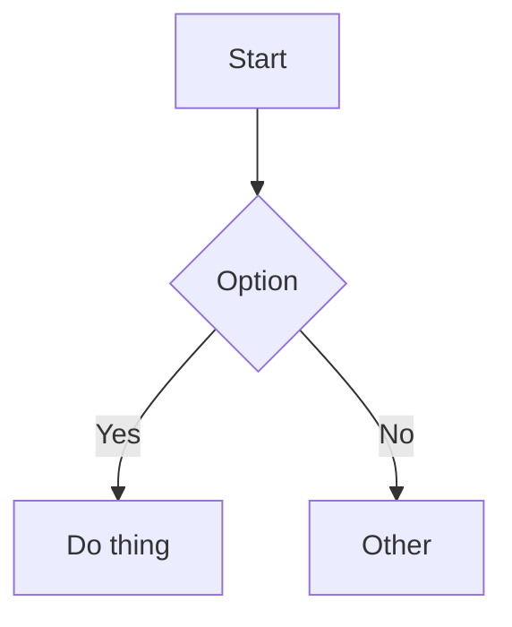

# hugo-trainsh — Usage Guide

This document explains how to use the `hugo-trainsh` theme in your Hugo site, including blog pages, tag filtering, code blocks (copy + soft wrap), TOC, Mermaid diagrams, math (KaTeX), PhotoSwipe lightbox, and upvotes.

## Table of contents

- [Installation](#installation)
- [Required site configuration](#required-site-configuration)
- [Content structure](#content-structure)
- [Navigation](#navigation)
- [Blog list: search + tag filtering](#blog-list-search--tag-filtering)
- [Tags](#tags)
- [Table of contents (TOC)](#table-of-contents-toc)
- [Code blocks](#code-blocks)
- [Mermaid diagrams](#mermaid-diagrams)
- [Math (inline + block)](#math-inline--block)
- [Images + PhotoSwipe lightbox](#images--photoswipe-lightbox)
- [Upvotes](#upvotes)
- [Customization](#customization)
  - [Styling](#styling)
  - [Social links](#social-links)
  - [Footer](#footer)

## Installation

### As a Git submodule (recommended)

```bash
git submodule add https://github.com/binbinsh/hugo-trainsh themes/hugo-trainsh
git submodule update --init --recursive
```

In your site config:

```toml
theme = "hugo-trainsh"
```

### As a Hugo module (optional)

If you prefer Hugo Modules:

```toml
[module]
  [[module.imports]]
    path = "github.com/binbinsh/hugo-trainsh"
```

## Required site configuration

### Enable the JSON index (search)

This theme uses `index.json` for client-side search.

```toml
[outputs]
home = ["HTML", "RSS", "JSON"]
```

### Set your main content sections

The theme lists posts from `params.mainSections` (default: `["posts"]`).

```toml
[params]
mainSections = ["posts"]
```

## Content structure

### Blog list page (`/blog/`)

Create a blog section page:

```
content/
  blog/
    _index.md
```

The theme provides the blog list layout at `/blog/`. The content of `content/blog/_index.md` is rendered at the top of the blog page (optional).

### Posts

Put your posts in a section that matches `params.mainSections` (e.g. `content/posts/`).

## Navigation

There are three ways to define navigation (in priority order):

1. `params.nav` (markdown string rendered inside `<nav>`)
2. `menu.main`
3. Theme fallback (Home + Blog)

Example `params.nav`:

```toml
[params]
nav = "[Home](/) [Now](/now/) [Projects](/projects/) [Blog](/blog/)"
```

## Blog list: search + tag filtering

The `/blog/` page includes:

- A search input (`Fuse.js` is lazy-loaded from a CDN when needed)
- A tag filter UI using `?q=tag1,tag2`
- A two-column post grid (responsive, single column on mobile)
- A tag cloud at the bottom

Search uses `index.json` (make sure you enabled it in `[outputs]`).

## Tags

### Tag normalization

If a tag contains spaces, the theme normalizes it by replacing whitespace with `-`.

Examples:

- `getting started` → `getting-started`
- `machine learning` → `machine-learning`

This normalization is applied consistently across:

- Post footer tags
- Blog list filtering data
- Blog tag cloud links
- `index.json` (search index)

## Table of contents (TOC)

TOC is **opt-in** (it is not automatically inserted).

Insert the shortcode where you want the TOC to appear:

```md

```

The TOC includes headings H2/H3.

## Code blocks

### Syntax highlighting

Use fenced code blocks with a language:

````md
```javascript
export function greet(name) {
  return `Hello, ${name}!`;
}
```
````

The theme uses a neutral highlighting palette and renders code blocks using Hugo's built-in highlighter.

### Wrap + copy buttons

Every code block shows two small icons in the top-right:

- **Soft wrap toggle**: toggles line wrapping for that block
- **Copy**: copies the block contents to clipboard (shows a short success state)

## Mermaid diagrams

Write Mermaid diagrams using a fenced code block:

````md

````

The theme renders Mermaid blocks as `<pre class="mermaid">…</pre>` and initializes Mermaid automatically when a page contains Mermaid content.

## Math (inline + block)

### Block math (theme-native)

Use a fenced `passthrough` code block:

````md
```passthrough
E = mc^2
```
````

### Inline + block math using Goldmark passthrough (recommended)

Enable Goldmark passthrough delimiters in your site config:

```toml
[markup]
  [markup.goldmark]
    [markup.goldmark.extensions]
      [markup.goldmark.extensions.passthrough]
        enable = true
        [markup.goldmark.extensions.passthrough.delimiters]
          block = [['$$', '$$'], ['\\[', '\\]']]
          inline = [['$', '$'], ['\\(', '\\)']]
```

Then you can write:

- Inline: `$a^2 + b^2 = c^2$`
- Block: `$$E = mc^2$$`

The theme renders math via KaTeX and includes KaTeX CSS automatically when math is detected.

## Images + PhotoSwipe lightbox

Markdown images are automatically wrapped with a link and rendered as a `<figure>`:

```md
")
```

Clicking the image opens a PhotoSwipe lightbox.

### Best practice: use page bundles for local images

If your image is a page resource, the theme can include intrinsic dimensions automatically (best UX):

```
content/posts/my-post/
  index.md
  my-image.jpg
```

And in `index.md`:

```md

```

Remote images also work; the lightbox will probe dimensions at runtime if needed.

## Upvotes

The theme includes an optional upvote widget at the bottom of posts. It expects two endpoints:

- `GET /api/upvote-info?slug=/path` → `{ upvote_count, upvoted }`
- `POST /api/upvote` (form data with `slug`) → `{ upvote_count, upvoted }`

### Site configuration

```toml
[params]
  [params.upvote]
    enabled = true
    endpoint = "/api/upvote"
    infoEndpoint = "/api/upvote-info"
```

### Per-post control

Upvotes are shown by default when enabled. To hide the widget on a specific post:

```toml
make_discoverable = false
```

### Backend deployment

This repo includes a Cloudflare Worker + KV backend in `cloudflare/`.

See [`docs/upvote.md`](upvote.md) for deployment instructions.

## Customization

### Styling

The theme uses plain CSS with CSS custom properties (variables) via Hugo Pipes:

- `assets/css/style.css`

Key CSS variables:

```css
:root {
  --width: 680px;
  --font-main: Verdana, sans-serif;
  --font-mono: ui-monospace, SFMono-Regular, "SF Mono", Menlo, Consolas, monospace;
  --font-scale: 1rem;
  --background-color: #fafafa;
  --heading-color: #1a1a1a;
  --text-color: #444;
  --link-color: #0066cc;
  --accent-color: #0077cc;
  --border-color: #ddd;
  --muted-color: #888;
}
```

Dark mode is automatically applied via `prefers-color-scheme: dark`.

### Width

The content width is controlled by `--width` in `assets/css/style.css`.

### Social links

Social links are configured via:

```toml
[params.social]
github = "https://github.com/yourname"
x = "https://x.com/yourname"
linkedin = "https://www.linkedin.com/in/yourname"
email = "hello@yourdomain.com"
```

These links appear in the footer as a horizontal list.

### Footer

The footer displays:

1. Social/subscribe links (RSS, GitHub, X, LinkedIn, Email) as a horizontal list
2. Copyright notice with site title and theme credit
