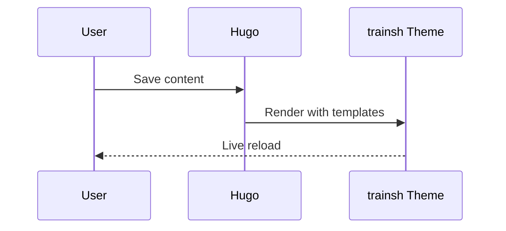

+++
title = 'Mermaid and Math Demo'
date = '2025-10-05'
draft = false
tags = ['mermaid','math']
translationKey = 'mermaid-math'
+++

## Mermaid



## Math

Inline math: $a^2 + b^2 = c^2$.

Block math:

```passthrough
\int_{-\infty}^{\infty} e^{-x^2} \, dx = \sqrt{\pi}
```
