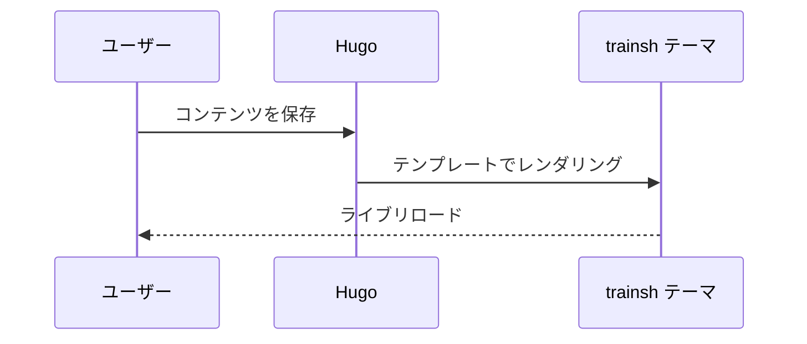

+++
title = 'Mermaid と数式のデモ'
date = '2025-10-05'
draft = false
tags = ['mermaid','数学']
translationKey = 'mermaid-math'
+++

## Mermaid



## 数式

インライン数式: $a^2 + b^2 = c^2$。

ブロック数式:

```passthrough
\int_{-\infty}^{\infty} e^{-x^2} \, dx = \sqrt{\pi}
```
