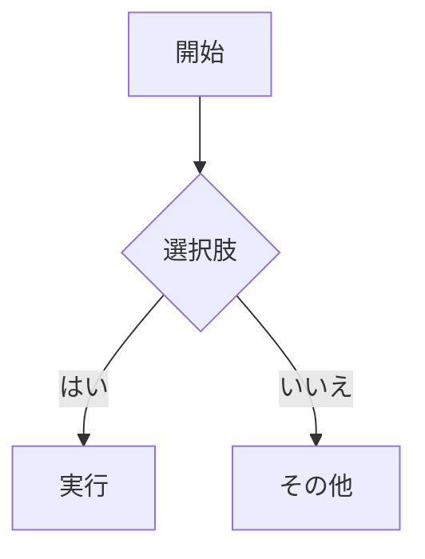

+++
title = 'trainsh クイックスタート'
date = '2025-10-26'
draft = false
tags = ['入門','テーマ','mermaid','数学']
translationKey = 'quick-start'
+++

## タイポグラフィとレイアウト

trainsh テーマのプレビュー用のサンプル記事です。



### この記事の内容
- 目次（TOC）
- Mermaid 図
- 数式（KaTeX を有効化している場合）
- 画像ライトボックス

### Mermaid



### 数式

```passthrough
E = mc^2
```

### 画像


### とても長いURL

- https://www.verylonglonglonglonglonglonglonglonglonglonglonglonglonglonglonglongdomain.com/news/new_center_opens_in_city_name_september_15_2023
