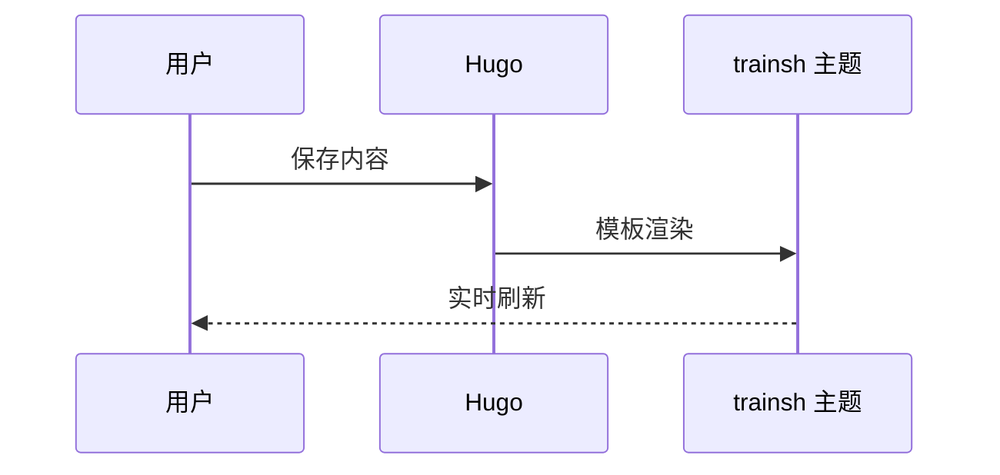

+++
title = '图表与公式演示'
date = '2024-09-07'
draft = false
tags = ['mermaid','数学']
translationKey = 'mermaid-math'
+++

## 时序图



## 公式

行内公式：$\alpha + \beta = \gamma$。

块级公式：

```passthrough
\sum_{i=1}^{n} i = \frac{n(n+1)}{2}
```
