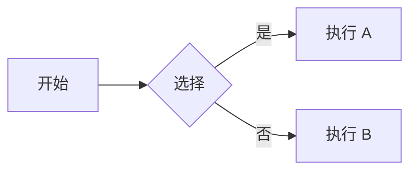

+++
title = '快速开始使用 trainsh'
date = '2025-09-21'
draft = false
tags = ['入门','主题','mermaid','数学']
translationKey = 'quick-start'
+++

## 排版与布局

这是一篇中文示例文章，用于预览 trainsh 主题的效果。

### 本文包含
- 二/三级标题
- Mermaid 图表
- 数学公式（KaTeX）
- 图片灯箱

### Mermaid



### 数学公式

```passthrough
S = \pi r^2
```

### 图片


