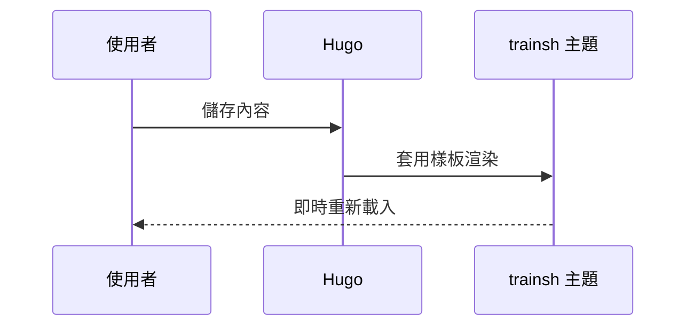

+++
title = 'Mermaid 與數學示範'
date = '2025-10-05'
draft = false
tags = ['mermaid','數學']
translationKey = 'mermaid-math'
+++

## Mermaid



## 數學

行內數學：$a^2 + b^2 = c^2$。

區塊數學：

```passthrough
\int_{-\infty}^{\infty} e^{-x^2} \, dx = \sqrt{\pi}
```
