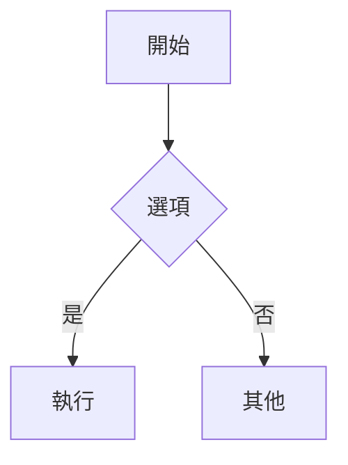

+++
title = 'trainsh 快速開始'
date = '2025-10-26'
draft = false
tags = ['入門','主題','mermaid','數學']
translationKey = 'quick-start'
+++

## 排版與版面

這是一篇示例文章，用於預覽 trainsh 主題。



### 本文包含的功能
- 目錄（TOC）
- Mermaid 圖表
- 數學（若已啟用 KaTeX）
- 圖片燈箱

### Mermaid



### 數學

```passthrough
E = mc^2
```

### 圖片


### 超長網址

- https://www.verylonglonglonglonglonglonglonglonglonglonglonglonglonglonglonglongdomain.com/news/new_center_opens_in_city_name_september_15_2023
